# Secure VPN connectivity, from Azure to remote third parties 

<!-- TOC -->

- [Secure VPN connectivity, from Azure to remote third parties](#secure-vpn-connectivity-from-azure-to-remote-third-parties)
- [Summary](#summary)
- [Introduction](#introduction)
    - [Context](#context)
    - [Typical requirements](#typical-requirements)
- [Azure VPN Gateway](#azure-vpn-gateway)
    - [Base lab](#base-lab)
    - [Azure VPN Gateway, default behaviour](#azure-vpn-gateway-default-behaviour)
    - [Azure VPN Gateway, be careful](#azure-vpn-gateway-be-careful)
    - [Azure VPN Gateway, policy based traffic selectors](#azure-vpn-gateway-policy-based-traffic-selectors)
    - [Azure VPN Gateway, traffic selector policies (preview)](#azure-vpn-gateway-traffic-selector-policies-preview)
    - [Azure VPN Gateway, traffic selector policies (preview) + connection mode](#azure-vpn-gateway-traffic-selector-policies-preview--connection-mode)
    - [Azure VPN Gateway summary](#azure-vpn-gateway-summary)
- [Overlapping IP / NAT](#overlapping-ip--nat)
- [Other solutions](#other-solutions)
    - [Azure Virtual WAN, routing intent policies (preview)](#azure-virtual-wan-routing-intent-policies-preview)
    - [Network Virtual Appliance (NVA)](#network-virtual-appliance-nva)
    - [Physical cloud edge/DMZ](#physical-cloud-edgedmz)
- [Closing](#closing)
    - [Other](#other)
    - [Thanks](#thanks)
    - [Appendix - Azure Traffic Selector Policies](#appendix---azure-traffic-selector-policies)

<!-- /TOC -->

# Summary

A semi-frequent requirement for customers on Azure is to connect their applications hosted in the cloud, over a private S2S VPN, to remote third parties.

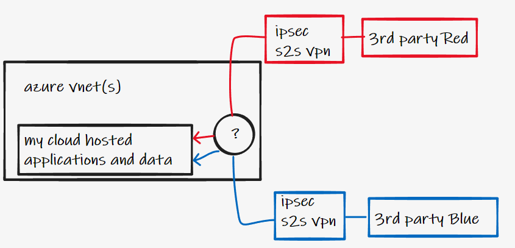

In this article we explore the different options for implementing this pattern, and show why the standard behaviour of native Azure VPN Gateways needs to be well understood before approaching this design.

_Spoiler tl;dr conclusion - You can do this using native Azure networking tools today using some toggles that are in preview. For now, any production designs should use a Network Virtual Appliance (NVA) based solution._

#  Introduction

## Context

As the centre of gravity for enterprise applications and data continues to move to the cloud, naturally requirements to connect existing third parties to these applications form part of conversations with many enterprise customers.

Previously third parties will have entered the corporate network via highly customisable physical firewalls within the On-Premises Data centre DMZ network. When we move to cloud, and perhaps even decomossion our on-premises DC, we need to reconsider the approach for third party VPN connectivity.

## Typical requirements

Prevalent in many industries and verticals, but especially in those adhering to regulatory frameworks such as FSI and Government, here is what I would consider a fairly standard, traditional set of VPN requirements for a typical Enterprise connecting to third parties. 

**Low Resolution**

- I understand that I am in the process of modernizing my application estate to adhere to principles such as Zero Trust, Internet-first and "Beyond VPN" however this _is a journey_. For the foreseeable future, whilst I and my regulators catch up, **I need to retain connectivity to my third party partners using a private network connection**
- It is implied that this therefore requires a **VPN** over the Internet, as the remote third party does not share my MPLS WAN
- I wish to provide this VPN server/headend function **in the cloud**, removing a dependency on my On-Premises Data centre, and optimizing the latency for my partners accessing applications now hosted in Azure

**Medium Resolution**

- The third parties I am connecting to are, whilst our trusted b2b partners, not within my administrative domain, and therefore should be treated as **untrusted from a network policy perspective**
- I.e. carte blanche access to my network inside of Azure is unacceptable, this should only be provided in a very prescriptive and controlled way
- I will connect to multiple different remote third parties

**High resolution**

- IP Routing. This type of B2B connection in regulated industries almost never uses BGP or dynamic routing protocols. **Policy based VPNs and static routing** still rule within this space. This values control and security over outright functionality, which is a perfectly acceptable trade off
- Network Firewall. All traffic from remote third party should not only traverse a IPsec VPN over the Internet to preserve the integrity of data, but I will also **require firewalling this traffic once it enters Azure**. I.e. Insert at least a layer 3/4 firewall between the remote private network and my internal network
- IKEv2 policy. Strictly control standards used for Phase 1 and Phase 2 **encryption and integrity algorithms**
- Whilst I need to provide connectivity to my Azure applications to multiple different third parties, I must **not enable those third parties to communicate via my VPN Server in Azure**
- Often times these third party networks will have **overlapping RFC1918**, not only with my VNet address space, but also with each other

# Azure VPN Gateway

Can we meet the above requirements using only a native Azure VPN Gateway? The answer is yes-ish, read on, this section is the main focus of the article.

## Base lab

If you are building a lab on Azure that involves VPNs you can almost certainly shortcut your work by using the excellent guides written by Jeremy Wright. That is exactly what we will do for our test bed. Borrowing heavily from ["S2S VPN between CSR and Azure VPN Gateway using crypto maps"](https://github.com/jwrightazure/lab/tree/master/csr-vpn-to-azurevpngw-ikev2-nobgp-crypto-maps) we quickly arrive at:

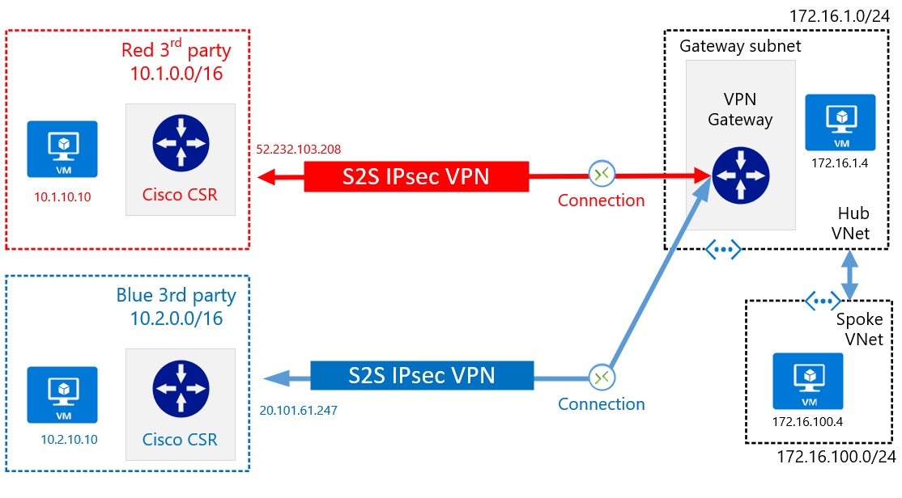

Summary of lab:

- Cisco CSR simulating 3rd parties VPN termination. No VTI, no BGP, crypto maps used for strict VPN setup
- Azure VPN Gateway (SKU VpnGw1) in our Azure Hub VNet, Route Based, no BGP, active/standby
- Test VMs and IP allocation as per diagram

## Azure VPN Gateway, default behaviour

For this test we setup standard connections to our blue and red third party sites, from our Azure VPN Gateway:

```
az network local-gateway create --gateway-ip-address 52.232.103.208 --name to-onprem1 --resource-group GBB-ER-LAB-UKS --local-address-prefixes 10.1.0.0/16
az network local-gateway create --gateway-ip-address 20.101.61.247 --name to-onprem2 --resource-group GBB-ER-LAB-UKS --local-address-prefixes 10.2.0.0/16
az network vpn-connection create --name to-onprem1-nots --resource-group GBB-ER-LAB-UKS --vnet-gateway1 VPN-GW-UKS -l uksouth --shared-key Msft123Msft123 --local-gateway2 to-onprem1 
az network vpn-connection create --name to-onprem2-nots --resource-group GBB-ER-LAB-UKS --vnet-gateway1 VPN-GW-UKS -l uksouth --shared-key Msft123Msft123 --local-gateway2 to-onprem2
```
> :bulb: Note. We are using an Azure Route-based VPN Gateway. The only "policy-based" gateway in Azure is the basic SKU, which is generally not used in production, especially as it only supports one remote S2S connection

Lets assume that our remote third party devices have been configured correctly, and that the specified crypto map is as per agreed terms. E.g. below for red third party. Note ```ip access-list extended VPN-Azure-to-Onprem``` which is used to define scope of encryption domain and traffic applicable for S2S VPN usage.

```
crypto map AZURE 10 ipsec-isakmp 
 set peer 52.151.66.181
 set security-association lifetime seconds 28800
 set transform-set AZURE 
 set pfs group2
 set ikev2-profile prof
 match address VPN-Azure-to-Onprem

ip access-list extended VPN-Azure-to-Onprem
 permit ip 10.1.0.0 0.0.255.255 172.16.0.0 0.0.255.255
```
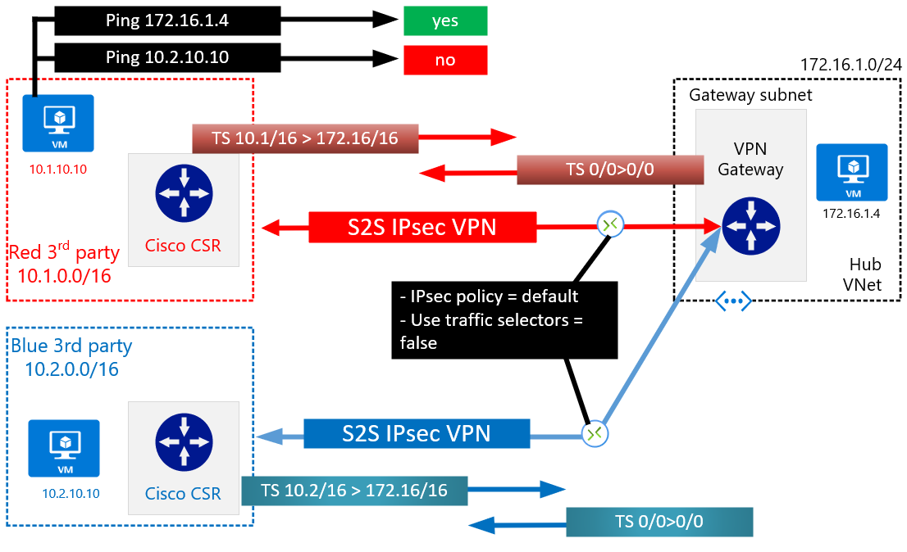

The resulting behaviour is as follows:

- Azure will act as both IKE initiator and responder
- Azure will initially<sup>1</sup> attempt to form connection using wide ```0.0.0.0/0 > 0.0.0.0/0``` Phase 2 traffic selectors (TSi)
- Red CSR will respond with narrower TSr ```10.1.0.0/16 > 172.16.0.0/16```
- Blue CSR will respond with narrower TSr  ```10.2.0.0/16 > 172.16.0.0/16```
- As per IKEv2 spec, TSi and TSr do _not_ need to match and the resulting final agreed TS will be the lowest common denominator, or narrowest combination. Which for us will be ```10.1.0.0/16 < > 172.16.0.0/16``` and ```10.2.0.0/16 < > 172.16.0.0/16```. I.e. Anything in Azure can talk to either branch, and vice versa
- _NB. If CSR initiation happens first, this will also work fine, with Azure acting as IKE responder_
- Automatic dynamic routing (system routes, next hop virtual network gateway) gets injected in to both Hub and Spoke VNets pointing 10.1.0.0/16 and 10.2.0.0/16 at VPN Gateway (reflecting LNG definitions)
- Red **cannot** talk to blue, both the Cisco CSR and Azure VPN Gateway do **not** have the required traffic selectors to permit ```10.1.0.0/16 < > 10.2.0.0/16```

<sup>1</sup>When using default connection setup TS behaviour is as follows:
-  Azure VPN Gateway will attempt 0/0 wide TS initially
- If unsuccessful (E.g. IKEV2_TS_UNACCEPTABLE message is returned) thenl failback and try narrow TS that reflect matrix of _VNet address spaces (in hub and spoke) > LNG prefixes_
- Finally, if this is unsuccessful it will also try even narrower TS of just _Hub VNet address space only > LNG_

0/0 TS attempted SEND can be verified within IKEDiagnostic logs (available via VPN Gateway Diagnostic logs export to Log Analytics). E.g.

```
Number of TSIs 1: StartAddress 0.0.0.0 EndAddress 255.255.255.255 PortStart 0 PortEnd 65535 Protocol 0 Number of TSRs 1:StartAddress 0.0.0.0 EndAddress 255.255.255.255 PortStart 0 PortEnd 65535 Protocol 0
```

## Azure VPN Gateway, be careful

But what if the third party network administrators of red and blue happen to misconfigure their devices, or a process error is made? 

> :bulb: Good to know. Even today, typically these inter-company VPNs are setup using manual forms exchanged via email, a process that is prone to error and misinterpretation

This time, the administrators for blue and red made mistakes when setting up their crypto maps, adding an additional line ```permit ip 10.0.0.0 0.255.255.255 10.0.0.0 0.255.255.255```.

```
//Red CSR
ip access-list extended VPN-Azure-to-Onprem
permit ip 10.1.0.0 0.0.255.255 172.16.0.0 0.0.255.255
permit ip 10.0.0.0 0.255.255.255 10.0.0.0 0.255.255.255

//Blue CSR
permit ip 10.1.0.0 0.0.255.255 172.16.100.0 0.0.0.255
permit ip 10.0.0.0 0.255.255.255 10.0.0.0 0.255.255.255
```

Everything remains the same in Azure, no changes to VPN Gateway config.

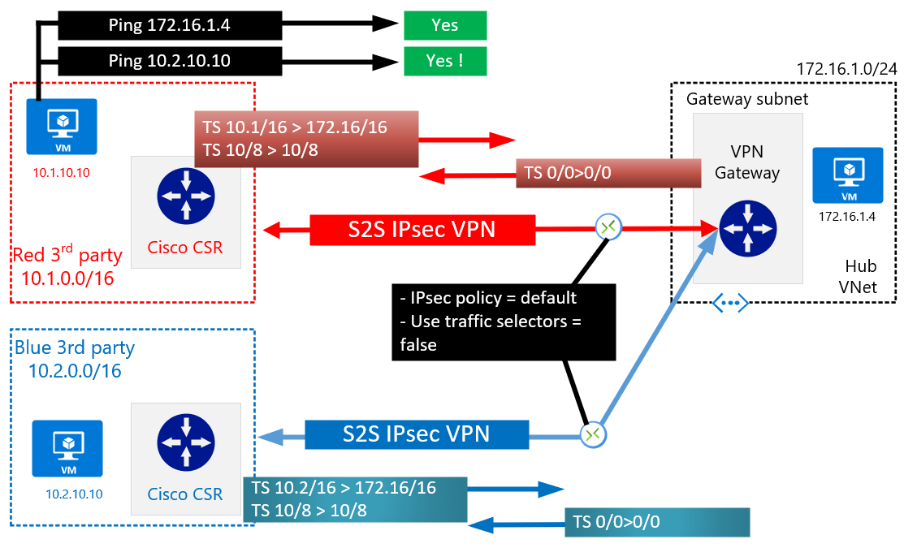

Lets test blue to red connectivity ```10.1.10.10 > 10.2.10.10```. Its not working - phew! Nevertheless, you check the active crypto phase 2 SA on the red third parties CPE.

```
Session status: UP-ACTIVE
Peer: 52.151.66.181 port 4500
  Session ID: 13
  IKEv2 SA: local 10.1.0.4/4500 remote 52.151.66.181/4500 Active
  IPSEC FLOW: permit ip 10.0.0.0/255.255.255.0 10.0.0.0/255.255.255.0
        Active SAs: 2, origin: crypto map
  IPSEC FLOW: permit ip 10.2.0.0/255.255.0.0 172.16.1.0/255.255.255.0
        Active SAs: 2, origin: crypto map
```

Ok so we _do_ have an active QMSA for the flow, this makes sense, because Azure VPN Gateway will accept any phase 2 TS in its default config. So why is red > blue not working? Because Azure VPN Gateway does not have an active TS on the blue connection, yet.

Let's generate some interesting traffic for ```10.2.10.10 > 10.1.10.10``` from the blue site. _Uh oh!_

```
gbb_admin@onprem1VM:~$ ifconfig -a
eth0: flags=4163<UP,BROADCAST,RUNNING,MULTICAST>  mtu 1500
        inet 10.1.10.10  netmask 255.255.255.0  broadcast 10.1.10.255

gbb_admin@onprem1VM:~$ ping 10.2.10.10
PING 10.2.10.10 (10.2.10.10) 56(84) bytes of data.
64 bytes from 10.2.10.10: icmp_seq=1 ttl=62 time=18.2 ms
64 bytes from 10.2.10.10: icmp_seq=2 ttl=62 time=18.7 ms
```

**We are now routing packets between the red third party and tje blue third party, via our own VPN Gateway. I'm sure our B2B partners did not sign up for this!**

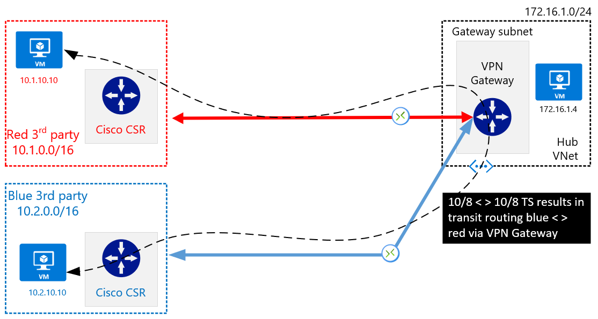

## Azure VPN Gateway, policy based traffic selectors

Let's think about some possible optimizations or toggles within our native Azure VPN Gateway that may help prevent this problematic transit behaviour. 

Generally the setting **use policy based traffic selector** has been used  to allow route-based Azure VPN Gateway to connect to [multiple on-premises policy-based](https://docs.microsoft.com/en-us/azure/vpn-gateway/vpn-gateway-connect-multiple-policybased-rm-ps) devices. 

> Setting "Use policy based traffic selector" to true on a connection will configure the Azure VPN gateway to connect to policy-based VPN firewall on premises. If you enable this field, you need to ensure your VPN device has the matching traffic selectors defined with all combinations of your on-premises network (local network gateway) prefixes to/from the Azure virtual network prefixes.

On the documentation page for this feature, we see the diagram below, _suggesting_ that this feature may be able to stop inter-third-party connectivity. Lets explore why this diagram is definitely a case of _it depends_.

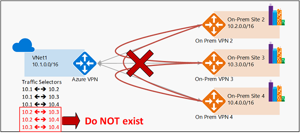

Let's delete our connection objects, and rebuild using policy-based traffic selectors.

> :warning: Make sure you not only enable ```use policy based traffic selector = true``` but also utilise a ```IPsec/IKE policy = custom```, otherwise your traffic selectors will be ineffective, as per [docs](https://docs.microsoft.com/en-us/azure/vpn-gateway/vpn-gateway-connect-multiple-policybased-rm-ps#:~:text=The%20configuration%20option%20is%20part%20of%20the%20custom%20IPsec/IKE%20connection%20policy.%20If%20you%20enable%20the%20policy-based%20traffic%20selector%20option%2C%20you%20must%20specify%20the%20complete%20policy). 

```
az network vpn-connection create --name to-onprem1-ts --resource-group GBB-ER-LAB-UKS --vnet-gateway1 VPN-GW-UKS -l uksouth --shared-key Msft123Msft123 --local-gateway2 to-onprem1 --use-policy-based-traffic-selectors true
az network vpn-connection create --name to-onprem2-ts --resource-group GBB-ER-LAB-UKS --vnet-gateway1 VPN-GW-UKS -l uksouth --shared-key Msft123Msft123 --local-gateway2 to-onprem2 --use-policy-based-traffic-selectors true
az network vpn-connection ipsec-policy add -g GBB-ER-LAB-UKS --connection-name to-onprem1-ts --dh-group DHGroup2 --ike-encryption AES256 --ike-integrity SHA1 --ipsec-encryption AES256 --ipsec-integrity SHA1 --pfs-group None --sa-lifetime 27000 --sa-max-size 102400000
az network vpn-connection ipsec-policy add -g GBB-ER-LAB-UKS --connection-name to-onprem2-ts --dh-group DHGroup2 --ike-encryption AES256 --ike-integrity SHA1 --ipsec-encryption AES256 --ipsec-integrity SHA1 --pfs-group None --sa-lifetime 27000 --sa-max-size 102400000
```

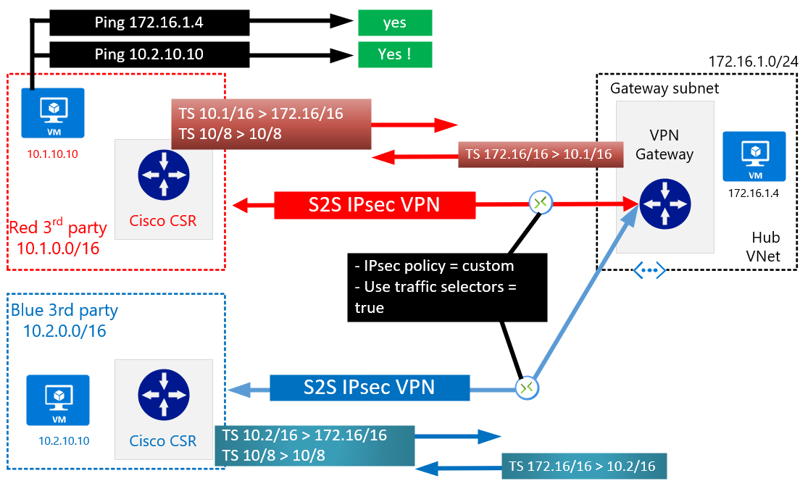

Why has this not helped us? Why can red still communicate with blue? Is the documentation image incorrect? It depends!

**Using _policy based traffic selectors = true_ has changed the behaviour of our VPN Gateway to _initially_ try narrow TS, but it still falls back to wide TS if these are not accepted. I.e. If the remote third party makes a mistake in their config, you can still enable transit routing via the VPN Gateway. And, importantly, the Azure VPN Gateway in this configuration still acts as a responder, and is willing to setup using wide TS if the third party proposes this.**

## Azure VPN Gateway, traffic selector policies _(preview)_

Ok lets keep going. Is there anything else we can do to help change this behaviour? The command [New-AzIpsecTrafficSelectorPolicy](https://docs.microsoft.com/en-us/powershell/module/az.network/new-azipsectrafficselectorpolicy?view=azps-6.5.0) is relatively unknown, lets look at what it can be used for. 

> :warning: This command/feature is classified as a **preview** as of October 2021, check the updated status and wait for GA before attempting to use in production.

By default, even when using the "Use policy based traffic selectors" on a connection, Azure VPN Gateway will, initially, send a combination of its own VNet address space (both hub and spokes if connected with "use remote gateway" ticked) as the source, and the ranges specified in the LNG as the destination. E.g.

- Hub = 172.16.1.0/24
- Spoke1 - 172.16.100.0/24
- LNG = 10.1.0.0/16

Resulting traffic selectors will be.

- 172.16.1.0/24 > 10.1.0.0/16
- 172.16.100.0/24 > 10.1.0.0/16

The command New-AzIpsecTrafficSelectorPolicy can be used to change this default behaviour and fix the narrow TS that are used. E.g. _PowerShell only at the moment_.

```
$ipsecPolicy = New-AzIpsecPolicy -SALifeTimeSeconds 27000 -SADataSizeKilobytes 102400000 -IpsecEncryption "AES256" -IpsecIntegrity "SHA1" -IkeEncryption "AES256" -IkeIntegrity "SHA1" -DhGroup "DHGroup2" -PfsGroup "None"
$trafficSelectorPolicy3 = New-AzIpsecTrafficSelectorPolicy -LocalAddressRange ("172.16.1.0/24") -RemoteAddressRange ("10.1.0.0/16")
$trafficSelectorPolicy4 = New-AzIpsecTrafficSelectorPolicy -LocalAddressRange ("172.16.1.0/24") -RemoteAddressRange ("10.2.0.0/16")
$vnetGateway = Get-AzVirtualNetworkGateway -ResourceGroupName GBB-ER-LAB-UKS -Name VPN-GW-UKS
$localnetGateway1 = Get-AzLocalNetworkGateway -ResourceGroupName GBB-ER-LAB-UKS -Name to-onprem1
$localnetGateway2 = Get-AzLocalNetworkGateway -ResourceGroupName GBB-ER-LAB-UKS -Name to-onprem2

New-AzVirtualNetworkGatewayConnection -ResourceGroupName GBB-ER-LAB-UKS -name to-onprem1-fixedts -location uksouth -VirtualNetworkGateway1 $vnetGateway -LocalNetworkGateway2 $localnetGateway1 -ConnectionType IPsec -SharedKey Msft123Msft123 -UsePolicyBasedTrafficSelectors $true -TrafficSelectorPolicy ($trafficSelectorPolicy3) -IpsecPolicies $ipsecPolicy
New-AzVirtualNetworkGatewayConnection -ResourceGroupName GBB-ER-LAB-UKS -name to-onprem2-fixedts -location uksouth -VirtualNetworkGateway1 $vnetGateway -LocalNetworkGateway2 $localnetGateway2 -ConnectionType IPsec -SharedKey Msft123Msft123 -UsePolicyBasedTrafficSelectors $true -TrafficSelectorPolicy ($trafficSelectorPolicy4) -IpsecPolicies $ipsecPolicy
```
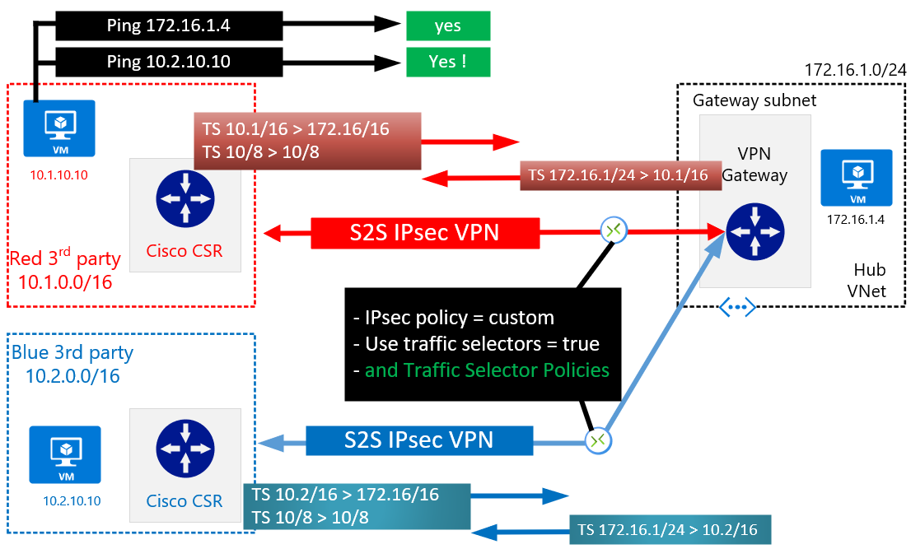

Why have these traffic selector policies not helped us? Why can red still communicate with blue?

**Traffic selector policies only change the narrow TS initially sent by Azure VPN Gateway. In its default configuration (acting as both an IKE responder and initiator), it will still accept wider TS if the remote party proposes them**

## Azure VPN Gateway, traffic selector policies _(preview)_ + connection mode

Just when you thought it was all over, there is another toggle.

> **Connection mode** is used to decide which gateway can initiate the connection.
When this value is set to:
Default: both Azure and on-premise VPN gateway can initiate the connection.
ResponderOnly: Azure VPN gateway will never initiate the connection. On-premise VPN gateway must initiate the connection.
InitiatorOnly: Azure VPN gateway will initiate the connection and reject any connection attempts from on-premise VPN gateway.

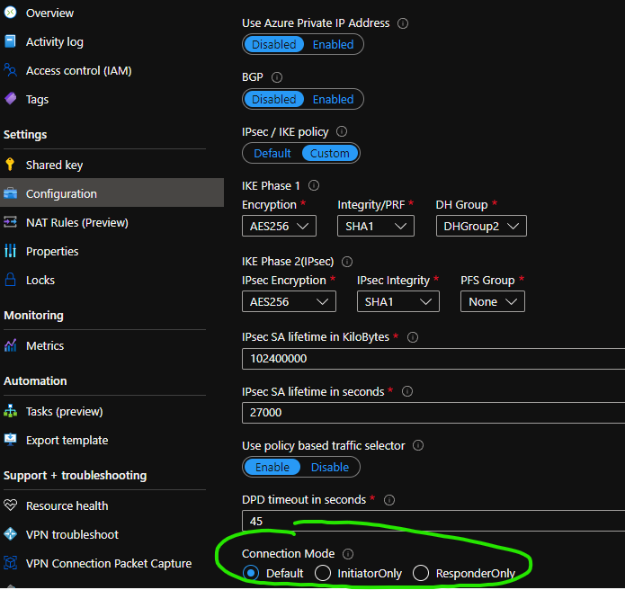

Lets once again rebuild our connections, this time with:
- ipsec policy = custom
- policy based traffic selectors = true
- traffic selector policies = yes
- connection mode = initiator only

```
$ipsecPolicy = New-AzIpsecPolicy -SALifeTimeSeconds 27000 -SADataSizeKilobytes 102400000 -IpsecEncryption "AES256" -IpsecIntegrity "SHA1" -IkeEncryption "AES256" -IkeIntegrity "SHA1" -DhGroup "DHGroup2" -PfsGroup "None"
$trafficSelectorPolicy5 = New-AzIpsecTrafficSelectorPolicy -LocalAddressRange ("172.16.1.0/24") -RemoteAddressRange ("10.1.0.0/16")
$trafficSelectorPolicy6 = New-AzIpsecTrafficSelectorPolicy -LocalAddressRange ("172.16.1.0/24") -RemoteAddressRange ("10.2.0.0/16")
$vnetGateway = Get-AzVirtualNetworkGateway -ResourceGroupName GBB-ER-LAB-UKS -Name VPN-GW-UKS
$localnetGateway1 = Get-AzLocalNetworkGateway -ResourceGroupName GBB-ER-LAB-UKS -Name to-onprem1
$localnetGateway2 = Get-AzLocalNetworkGateway -ResourceGroupName GBB-ER-LAB-UKS -Name to-onprem2

New-AzVirtualNetworkGatewayConnection -ResourceGroupName GBB-ER-LAB-UKS -name to-onprem1-fixedts-initiator -location uksouth -VirtualNetworkGateway1 $vnetGateway -LocalNetworkGateway2 $localnetGateway1 -ConnectionType IPsec -SharedKey Msft123Msft123 -UsePolicyBasedTrafficSelectors $true -TrafficSelectorPolicy ($trafficSelectorPolicy3) -IpsecPolicies $ipsecPolicy -connectionmode InitiatorOnly
New-AzVirtualNetworkGatewayConnection -ResourceGroupName GBB-ER-LAB-UKS -name to-onprem2-fixedts-initiator -location uksouth -VirtualNetworkGateway1 $vnetGateway -LocalNetworkGateway2 $localnetGateway2 -ConnectionType IPsec -SharedKey Msft123Msft123 -UsePolicyBasedTrafficSelectors $true -TrafficSelectorPolicy ($trafficSelectorPolicy4) -IpsecPolicies $ipsecPolicy -connectionmode InitiatorOnly
```

Initially the connections do not come up due to TS mismatch. I've found that, when using Azure VPN Gateway connection mode set as _initiator-only_, along with the use of fixed TS (Traffic selector policies), the remote third party must have traffic selectors that match exactly to make a successful phase 2 exchange.

We reconfigure our Cisco CSR to match the fixed TS exactly;
```
//red
ip access-list extended VPN-Azure-to-Onprem
 permit ip 10.1.0.0 0.0.255.255 172.16.1.0 0.0.0.255

//blue
ip access-list extended VPN-Azure-to-Onprem
 permit ip 10.2.0.0 0.0.255.255 172.16.1.0 0.0.0.255
 ```

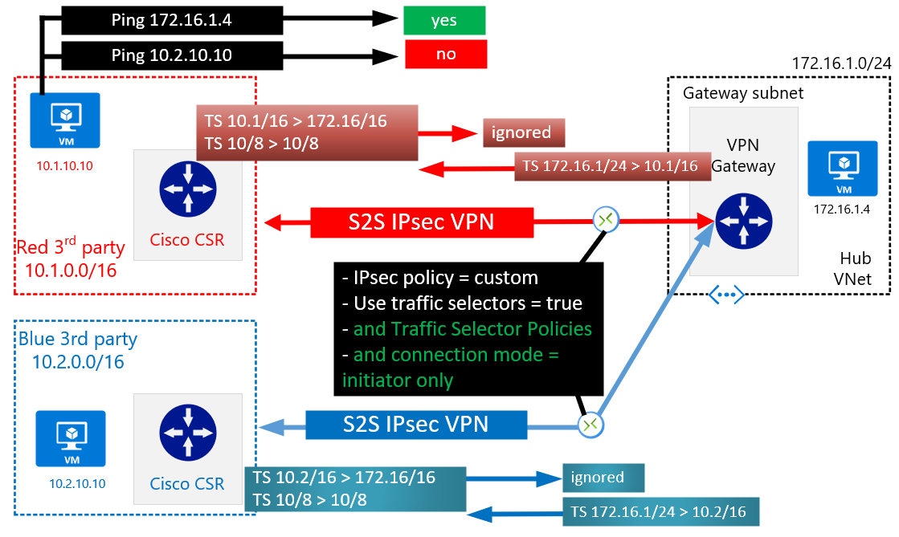

Solved, red can no longer talk to blue!

What is happening?
- Azure will act as IKE initiator only (it will reject incoming requests)
- Azure will attempt to form connection using narrow ```172.16.1.0/24 > 10.1/2.0.0/16``` Phase 2 traffic selectors (TSi)
- Red/blue CSR must respond with traffic selector within this scope (equal to or narrower)
- Red CSR responds with narrower TSr reflecting in its ACL ```10.1.0.0/16 > 172.16.1.0/24```
- Blue CSR will respond with narrower TSr reflecting in its ACL ```10.2.0.0/16 > 172.16.1.0/24```
- Azure to blue/red tunnels are formed with narrow TS, and cannot be formed with anything wider
- Automatic dynamic routing gets injected in to both Hub and Spoke VNets pointing 10.1.0.0/16 and 10.2.0.0/16 at VPN Gateway (reflecting LNG definitions)
  - **NB. In our eaxample, Red/blue can only contact the hub VM within the narrower 172.16.1.0/24 range, the spoke VM being outside of the custom traffic selector defonition is not eligible for encryption<sup>1</sup>**
- Red **cannot** talk to blue, both the Cisco CSR and Azure VPN Gateway do **not** have the required traffic selectors to permit ```10.1.0.0/16 < > 10.2.0.0/16```

<sup>1</sup>See appendix for another example use case for this feature.

## Azure VPN Gateway summary

That was a really long way of saying:

> For S2S VPN designs involving multiple third parties connecting to Azure via a native VPN Gateway: to sufficiently lock down the IKEv2 protocol exchange to prevent undesirable transit behaviour you must use a combination of Traffic Selector policies and Initiator-only connection mode. However, again, please note that Traffic Selector policies are not GA at this time.

# Overlapping IP / NAT

Let's address the elephant in the room. Yes, we may be able to use the above logic to find a workable solution using Azure VPN Gateway, but what about overlapping IP addresses. This is an area to explore in the future articles, just be aware that there is now a feature that is aimed at this space: [NAT on Azure VPN Gateways](https://docs.microsoft.com/en-us/azure/vpn-gateway/nat-howto). Please note this is currently in _preview_ as of October 2021. 

The main reason for not exploring this further at this time, is an existing preview caveat making it incomaptible with Policy Based Traffic Selectors:
-
> [NAT rules are not supported on connections that have Use Policy Based Traffic Selectors enabled.](https://docs.microsoft.com/en-us/azure/vpn-gateway/nat-howto#:~:text=NAT%20rules%20are%20not%20supported%20on%20connections%20that%20have%20Use%20Policy%20Based%20Traffic%20Selectors%20enabled.)


# Other solutions

Thus far all discussion has focused on Azure VPN Gateway only, and exploring its behaviour/tuning in respect to IKEv2 negotiation. There are, however, other options to meet our [requirements](#typical-requirements) of strict, secure third party connectivity.

## Azure Virtual WAN, routing intent policies _(preview)_

_Work in progress_

## Network Virtual Appliance (NVA)

Third Party Network appliances are available from most leading network vendors via the Azure Marketplace. These appliances can be used to meet all of the above requirements thanks to an almost unlimited scope for customisation. 
Specifically they mostly can;

- perform granular ikev2 phase 2 custom
- perform firewalling "in box" for tunnel to tunnel traffic
- allow multi vrf designs which enable scenarios requiring both strict isolation and dynamic routing using protocols such as BGP
- perform NAT or double-NAT to cater for overlapping IP scenarios

Examples include:

- [Cisco CSR - thanks again Jeremy!](https://github.com/jwrightazure/lab/tree/master/csr-vpn-to-csr-ikev2-overlappingAdress)
- [Aviatrix](https://aviatrix.com/learn-center/cloud-networking/handling-overlapping-ips/)

**Today, if you need a GA production ready solution today (_to meet the [ requirements](#typical-requirements) laid out in this specific document) the recommendation is to look at a third party NVA based architecture. (But please do kick the tyres on the preview featurs of the Cloud native solutions posed above).**

## Physical cloud edge/DMZ

If you are already following a physical Cloud Edge model, wherein you have deployed Edge Routers under your administrative control within colocation facilities close to major cloud vendors, it may be easier and just as performant to utilise these physical devices. E.g.

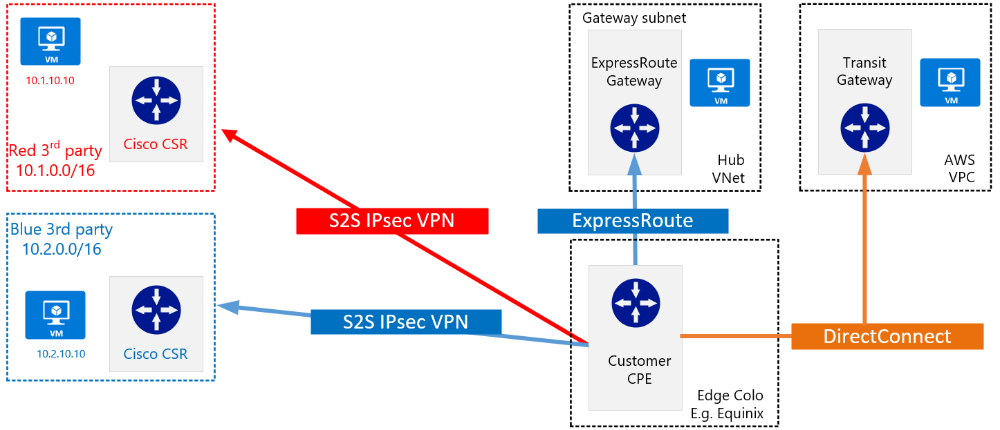

 
# Closing

## Other

I made heavy use of the following debug commands on the Cisco CSR NVA appliance during this testing:

- clear crypto session
- clear crypto ikev2 sa
- clear crypto sa
- debug crypto ikev2 packet
- debug crypto ikev2 internal
- (term mon)

## Thanks

- Jeremy Wright
- Marc de Droog
- Stefano Gagliardi
- Ahmad AlDeiri
- ...anyone I forgot

## Appendix - Azure Traffic Selector Policies 

> :warning: This feature is in preview.

Using the preview command New-AzIpsecTrafficSelectorPolicy we are able to lock down the encryption domain on a per connection basis. This not only enables us to stop transit routing, but it can be used to enable other scenarios.

In the diagram below the red 3rd party can only ever access vnet resources within the 172.16.100.0/24 spoke (regardless of what TS they specify). Likewise, the blue 3rd party can only ever access VNet resource within the 172.16.200.0/24 spoke.

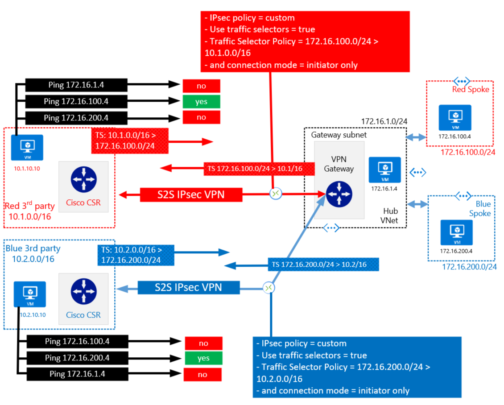

Typically this function (filtering specific remote sites to specific folks is performed by a layer3/4 firewall inline between VPN Gateway and Spoke), but perhaps this IKEv2 pattern may prove useful for some scenarios.

You could also add traditional firewall filtering in the mix for another level of protection if required, this would also provide a more scalable way of port level L4 filtering. E.g.

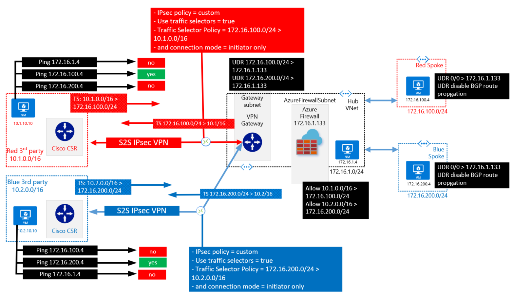

