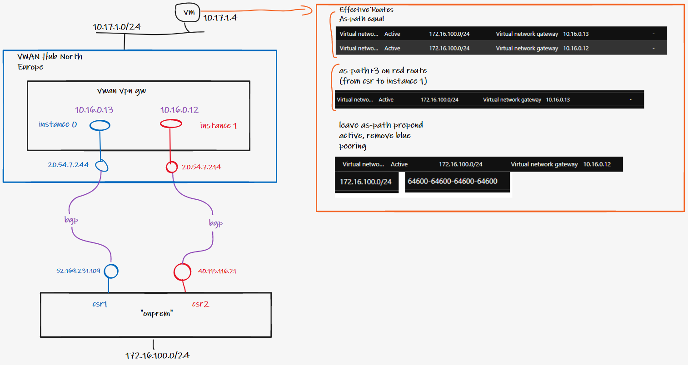

# AS-path manipulation on Active/Active VPN Gateways

A short note with minor explanation, logging to capture learning rather than forget!

## Scenario

Onprem site (172.16.100.0/24) has multiple external ISPs, different external Public IP, both fronting the same internal subnet.

E.g. Clustered firewall with multiple external if, or multiple DC with Layer-2 span/DCI.

Connected to only one instance (0 or 1) of an active/active VPN Gateway pair, due to onprem constraints.

## Exam question

Is As-path compared across VPN Gateway instances, before prefixes are advertised in to the VNet?

Answer = yes, as per diagram below.

I.e. 

- if as-path is equal, VNet will ECMP to in0 and in1.
- if as-path is unequal, single next-hop will be advertised to VNet
