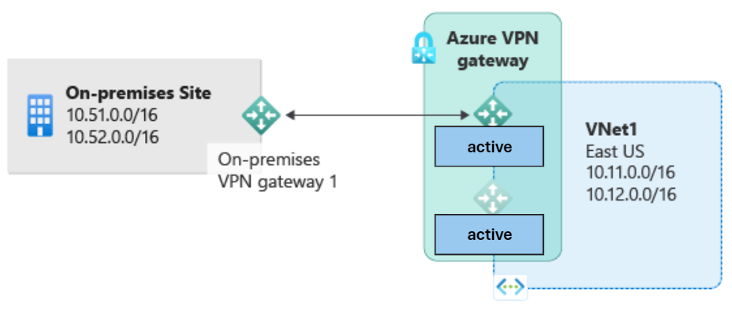

# What happens to my IP addresses if a VPN node fails in Azure?

## Context

Checkout the official MS Docs on VPN Gateway high availability https://learn.microsoft.com/en-us/azure/vpn-gateway/vpn-gateway-highlyavailable

The major decision is whether to run the VPN GW active-standby (A/S) or active-active (A/A).

**A/S**

- Can only establish tunnel(s) only to primary node
- VPN GW resource only has one PIP to attach to
- VPN GW resource only has one Private IP to attach to (if using [this feature](https://learn.microsoft.com/en-us/azure/vpn-gateway/site-to-site-vpn-private-peering#portal) with AZ SKU GW)
- VPN GW only has one BGP IP to peer with (I am assuming no use of additional [APIPA](https://learn.microsoft.com/en-us/azure/vpn-gateway/bgp-howto#:~:text=BGP%20IP%20address.-,Important,-By%20default%2C%20Azure) ranges)

Failover in this scenario is as simple and easy as you would expect. If the active node goes down (maintenance, failure, etc), then Azure takes care of failing over all of the above. Public IP, Private IP, and BGP IPs. Once the platform sorts out the underlying infrastrucutre, your connectivity will come back online.

**A/A**

_This also applies to VPN Gateway inside of Azure Virtual WAN which are always A/A_

- Can establish tunnel(s) to primary and/or secondary node
- VPN GW resource only has two PIPs to attach to
- VPN GW resource has two Private IPs to attach to (if using [this feature](https://learn.microsoft.com/en-us/azure/vpn-gateway/site-to-site-vpn-private-peering#portal) with AZ SKU GW)
- VPN GW only has two BGP IP to peer with (I am assuming no use of additional [APIPA](https://learn.microsoft.com/en-us/azure/vpn-gateway/bgp-howto#:~:text=BGP%20IP%20address.-,Important,-By%20default%2C%20Azure) ranges)

Failover in this scenario should also be simple, **as long as you standup tunnels to both primary and secondary nodes**. If not, there be dragons, which is what the below section covers.

🐉 Be Careful with single tunnels and A/A GW 🐉

Let's say you are happily running an A/S GW with tunnels only to the primary node, and you upgrade to A/A, perhaps to get compatibility with another service such as [Azure Route Server](https://learn.microsoft.com/en-us/azure/route-server/expressroute-vpn-support#:~:text=route%20exchange.-,Important,-Azure%20VPN%20gateway). Now lets say you forget to build those second tunnels, and end up with something like this:

What happens if the "first node", I.e. the node my tunnel is connected to, fails?

If you are using BGP:
- Public IP = does not failover
- Private IP = does not failover
- BGP peer IP = does not failover

If you are not using BGP:
- Public IP = fails over
- Private IP = does not failover
- BGP peer IP = n/a

So make your life easy/simple and always ensure tunnels are built to both nodes if using A/A Gateways (or Virtual WAN). The only scenario where it is "safe" (still not best practice or sensible considering the minimal effort) not to, is if you are not using BGP, and you are only using tunnels over the Internet to PIP. 

