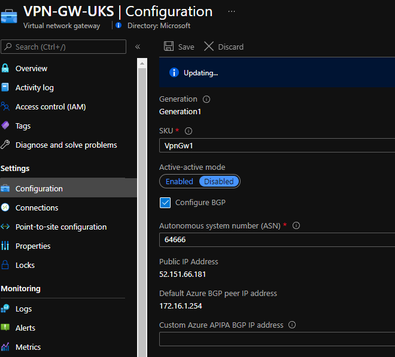
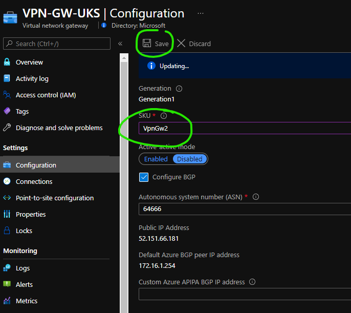

# Expected downtime when resizing VPN Gateway SKU

Will I experience downtime when changing the SKU of my VPN Gateway?

## Context

Sometimes it is required to change your VPN Gateway SKU, this can be for scale or performance reasons, but also for feature specific requirements. E.g. VPN NAT is only supported on [VpnGW2](https://docs.microsoft.com/en-us/azure/vpn-gateway/nat-howto#:~:text=NAT%20is%20supported%20on%20the%20the%20following%20SKUs%3A%20VpnGw2~5%2C%20VpnGw2AZ~5AZ.) and above.

More info on G/W resizing [here](https://docs.microsoft.com/en-us/azure/vpn-gateway/vpn-gateway-about-vpn-gateway-settings#resizechange).

## Testing

### Before

- VPN Gateway Generation 1
- SKU VpnGw1
- Active/Standby
- BGP enabled = yes



### After

Using the portal I set the SKU to VpnGw2 and clicked "save".



### Results

The ARM request took X minutes to complete.

```
//172.16.1.4 is a VM in Azure, this is being sourced from my branch network

PING 172.16.1.4 (172.16.1.4) 56(84) bytes of data.
64 bytes from 172.16.1.4: icmp_seq=45 ttl=63 time=165 ms
64 bytes from 172.16.1.4: icmp_seq=46 ttl=63 time=29.7 ms
64 bytes from 172.16.1.4: icmp_seq=47 ttl=63 time=12.7 ms
64 bytes from 172.16.1.4: icmp_seq=48 ttl=63 time=11.6 ms
64 bytes from 172.16.1.4: icmp_seq=49 ttl=63 time=26.5 ms
64 bytes from 172.16.1.4: icmp_seq=50 ttl=63 time=8.85 ms
64 bytes from 172.16.1.4: icmp_seq=51 ttl=63 time=9.60 ms
^C
--- 172.16.1.4 ping statistics ---
317 packets transmitted, 222 received, 30% packet loss, time 51056ms
rtt min/avg/max/mdev = 8.853/37.880/165.954/52.856 ms

//95 pings lost = 95 seconds downtime
```

5 minutes in to the operation I experience around **90 seconds** of downtime on my S2S connections utilizing this gateway.

# Closing

In this test, using Gen1 gateways, I experienced around 90 seconds downtime for this "inflight" upgrade. YMMV based on SKU type and configuration.

